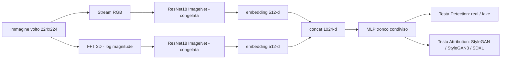
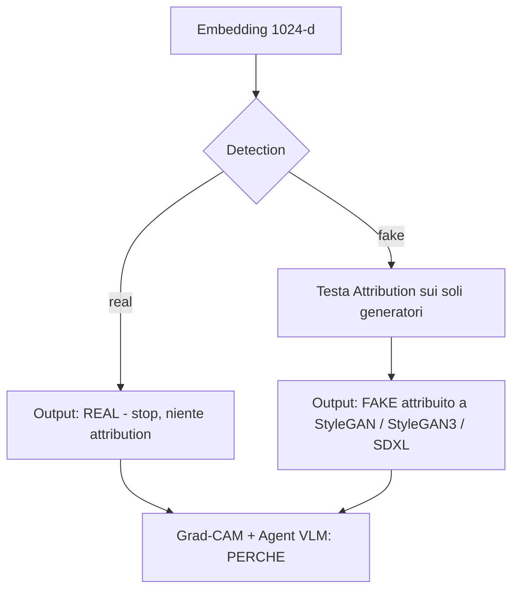

# DFFA — Deepfake Forensics & Attribution

Pipeline forense multi-stream (RGB + spettro di Fourier → ResNet18) che **rileva** volti sintetici, ne **attribuisce il generatore** in cascata e **spiega** ogni decisione con Grad-CAM e un agent VLM open. Pensata per girare gratis su Google Colab (GPU T4).


> Progetto per il corso *Multimedia Forensics* — Laurea Magistrale (A.A. 2025-26), UniCT.

---

## Caratteristiche principali

- **Detection real/fake** su singolo volto a partire da due stream complementari (immagine RGB + spettro di magnitudine della FFT 2D).
- **Attribution del generatore in cascata**: se l'immagine è *fake*, una seconda testa la attribuisce a `StyleGAN` / `StyleGAN3` / `SDXL`. L'attribution non contiene la classe `real`, quindi **non può mai contraddire** la detection.
- **Feature extraction a doppio backbone ResNet18** pre-addestrato su ImageNet e **congelato**: due embedding da 512-d concatenati (1024-d). Gli embedding sono **pre-calcolati e messi in cache** su disco → training del classificatore in pochi secondi.
- **Classificatore multi-task** a tronco condiviso con due teste; attribution addestrata sui *soli* fake via `ignore_index=-1`; selezione del modello sulla **cascade accuracy** end-to-end.
- **Explainability a due livelli**: Grad-CAM su entrambi gli stream (*dove* guarda la rete, nello spazio e in frequenza) + **agent VLM open** (Qwen2.5-VL, 4-bit) che produce la motivazione in linguaggio naturale; **fallback template-based deterministico** se manca la GPU.
- **Riproducibilità**: seed globale, cuDNN deterministico, split stratificato, configurazione interamente serializzata in YAML.
- **Download dataset lightweight** dal *datasets-server* di HuggingFace (endpoint `/rows`): niente parquet/tar interi.

---

## Architettura



### Inferenza a cascata



L'agent VLM riceve immagine RGB, spettro di Fourier e overlay Grad-CAM **insieme** alle probabilità del classificatore, e produce una spiegazione che distingue la motivazione della *detection* da quella dell'*attribution*. Dettaglio completo in [`docs/architecture.md`](docs/architecture.md).

---

## Tech Stack & Prerequisiti

| Componente | Tecnologia | Versione minima |
|------------|-----------|----------------:|
| Linguaggio | Python | 3.10 |
| Deep learning | PyTorch + torchvision | 2.1 / 0.16 |
| Numerico / immagini | NumPy, Pillow, scikit-learn, matplotlib | 1.24 / 10.0 / 1.3 / 3.7 |
| Config / utilità | PyYAML, tqdm | 6.0 / 4.66 |
| Agent VLM *(extra `vlm`)* | transformers, accelerate, bitsandbytes, qwen-vl-utils, sentencepiece | 4.49 / 0.34 / 0.43 / 0.0.8 / 0.1.99 |
| Hardware (consigliato) | GPU CUDA (es. Colab **T4**, 16 GB) | — |

> [!NOTE]
> Il progetto non richiede alcun file `.env` né chiavi API: l'agent è un VLM **open** eseguito localmente. La quantizzazione 4-bit (`bitsandbytes`) richiede CUDA; **in assenza di GPU** detection, attribution e Grad-CAM funzionano comunque e l'agent ricade automaticamente sulla spiegazione *template-based*.

---

## Installazione e Configurazione

```bash
# 1. Clona il repository
git clone https://github.com/giuliopedicone02/MultimediaForensics.git
cd MultimediaForensics/Progetto

# 2. Ambiente virtuale
python -m venv .venv && source .venv/bin/activate

# 3a. Installazione libreria (detection + attribution + Grad-CAM)
pip install -e .

# 3b. Con l'agent VLM (richiede GPU CUDA per il 4-bit)
pip install -e ".[vlm]"

# 4. Scarica un subset del dataset (4 classi x N immagini) da HuggingFace
python scripts/download_data.py --per-class 300
```

Il download popola `data/<classe>/` con le classi `real`, `stylegan`, `stylegan3`, `sdxl`:

```
data/
├── real/        # FFHQ                 (bitmind/ffhq-256)
├── stylegan/    # StyleGAN             (34data/STYLEGAN)
├── stylegan3/   # StyleGAN3            (34data/stylegan3_T_FFHQU_processed)
└── sdxl/        # Stable Diffusion XL  (bitmind/ffhq-256___stable-diffusion-xl-base-1.0)
```

> [!IMPORTANT]
> `data/` e `results/` sono **gitignorati** (dataset e artefatti pesano): vanno rigenerati con `download_data.py` su ogni nuova macchina/runtime. Le classi assenti su disco vengono ignorate automaticamente, quindi puoi partire con un sottoinsieme.

La configurazione è centralizzata in [`configs/default.yaml`](configs/default.yaml) e nella dataclass `dffa.config.Config` (serializzabile YAML round-trip). Parametri principali:

```yaml
classes: [real, stylegan, stylegan3, sdxl]
image_size: 224
max_per_class: null      # null = tutte; es. 250 per un run rapido
epochs: 30
batch_size: 32
lr: 0.001
vlm_model_id: Qwen/Qwen2.5-VL-3B-Instruct
vlm_load_in_4bit: true
seed: 42
```

---

## Guida all'uso

### Esecuzione completa (consigliata) — notebook su Colab T4

```text
1. Apri  notebooks/01_deepfake_forensics_colab.ipynb  in Google Colab
2. Runtime → Change runtime type → T4 GPU
3. Esegui la cella "0. Bootstrap": su Colab fa clone + install + download dataset
4. Esegui le celle in ordine:
   setup → config → dati → feature → training → valutazione →
   Grad-CAM → spiegazione VLM → salvataggio risultati
```

La cella di bootstrap è **idempotente**: su Colab esegue `git clone`, installa le dipendenze e scarica i dati; in locale (dove `dffa` è già importabile) si salta da sola.

### Uso programmatico della libreria

```python
from dffa.config import Config
from dffa.data import build_splits
from dffa.features import DualStreamExtractor
from dffa.engine import extract_embeddings, train_classifier, evaluate, _loader_from_blob
from dffa.utils import set_seed, get_device

cfg = Config(classes=["real", "stylegan", "stylegan3", "sdxl"], max_per_class=250)
set_seed(cfg.seed)
device = get_device(cfg.device)

splits = build_splits(cfg)
extractor = DualStreamExtractor(pretrained=True, freeze=True).to(device)

# embedding pre-calcolati e messi in cache su disco
blobs = {s: extract_embeddings(splits[s], cfg, extractor, device,
                               cache_path=f"results/emb_{s}.pt")
         for s in ["train", "val", "test"]}

# training multi-task (detection + attribution) con selezione su cascade_acc
model, history = train_classifier(blobs["train"], blobs["val"], cfg, device)

# valutazione end-to-end
res = evaluate(model, _loader_from_blob(blobs["test"], cfg, shuffle=False), cfg, device)
print(res["detection_acc"], res["attribution_acc"], res["cascade_acc"])
```

### Spiegazione di una predizione (Grad-CAM + VLM)

```python
from dffa.models import cascade_predict
from dffa.explain import VLMExplainer, build_evidence

# decisione a cascata: detection → se fake → attribution
pred, decisions = cascade_predict(model, emb, cfg.generator_classes)

# agent VLM (con fallback template se la GPU/modello non è disponibile)
explainer = VLMExplainer(cfg.vlm_model_id, load_in_4bit=cfg.vlm_load_in_4bit)
explainer.load()
evidence = build_evidence(pred["detection_prob"][0].cpu().numpy(),
                          pred["attribution_prob"][0].cpu().numpy(),
                          cfg.generator_classes)
exp = explainer.explain(images, evidence)   # images: {'rgb','fourier','gradcam'}
print(exp.source, exp.text)                 # source: "vlm" | "template"
```

### Download — opzioni della CLI

```bash
python scripts/download_data.py --per-class 500              # 500 per classe
python scripts/download_data.py --only real stylegan        # solo alcune classi
python scripts/download_data.py --per-class 300 --out data  # cartella di output
```

---

## Test

Il progetto **non include una suite `pytest`**: la validazione è effettuata tramite uno *smoke test* end-to-end della pipeline su un sottoinsieme dei dati. Per verificare l'intera catena in locale (CPU, in pochi secondi):

```bash
# 1. Verifica che il package importi e che la Config faccia round-trip YAML
python -c "import dffa; from dffa.config import Config; \
Config().to_yaml('results/_cfg.yaml'); print('dffa', dffa.__version__, 'OK')"

# 2. Validità strutturale del notebook (JSON nbformat)
python -c "import json; nb=json.load(open('notebooks/01_deepfake_forensics_colab.ipynb')); \
print('notebook OK:', nb['nbformat'], len(nb['cells']), 'celle')"

# 3. Smoke test della pipeline su un subset ridotto
python -c "
from dffa.config import Config
from dffa.data import build_splits
from dffa.features import DualStreamExtractor
from dffa.engine import extract_embeddings, train_classifier, evaluate, _loader_from_blob
from dffa.utils import set_seed, get_device
cfg = Config(max_per_class=20); set_seed(cfg.seed); dev = get_device('cpu')
sp = build_splits(cfg); ex = DualStreamExtractor().to(dev)
b = {s: extract_embeddings(sp[s], cfg, ex, dev) for s in ['train','val','test']}
m,_ = train_classifier(b['train'], b['val'], cfg, dev)
r = evaluate(m, _loader_from_blob(b['test'], cfg, shuffle=False), cfg, dev)
print('det', r['detection_acc'], 'attr', r['attribution_acc'], 'cascade', r['cascade_acc'])
"
```

> [!NOTE]
> Lo smoke test richiede che `data/<classe>/` sia già popolata (vedi *Installazione*). Con un modello poco addestrato i valori di accuracy sono solo indicativi: servono a verificare che la pipeline giri end-to-end senza errori.

---

## Struttura del repository

```
Progetto/
├── configs/default.yaml          # iperparametri e percorsi
├── dffa/                         # libreria
│   ├── config.py                 # dataclass di configurazione (YAML)
│   ├── data/dataset.py           # dataset dual-stream + split stratificati
│   ├── features/
│   │   ├── fourier.py            # spettro di Fourier
│   │   └── extractor.py          # ResNet18 embedder (RGB + Fourier)
│   ├── models/classifier.py      # MLP multi-task + cascade_predict
│   ├── explain/
│   │   ├── gradcam.py            # Grad-CAM + overlay
│   │   └── vlm_agent.py          # agent VLM open (+ fallback template)
│   ├── engine.py                 # embedding (cache), train, eval
│   └── utils/common.py           # seed, device, I/O
├── scripts/download_data.py      # download subset da HuggingFace (/rows)
├── notebooks/01_deepfake_forensics_colab.ipynb
├── docs/architecture.md          # dettaglio architetturale
├── report/report.md              # relazione
├── data/                         # dataset (NON versionato)
└── results/                      # metriche, figure, cache (NON versionato)
```

---

## Riferimenti

- Karras et al., *A Style-Based Generator Architecture for GANs* (StyleGAN), CVPR 2019.
- Karras et al., *Alias-Free GAN* (StyleGAN3), NeurIPS 2021.
- Frank et al., *Leveraging Frequency Analysis for Deep Fake Image Recognition*, ICML 2020.
- Selvaraju et al., *Grad-CAM: Visual Explanations from Deep Networks*, ICCV 2017.
- Bai et al., *Qwen2.5-VL Technical Report*, 2025.

## Licenza

Distribuito sotto licenza **MIT** — vedi [LICENSE](LICENSE).
