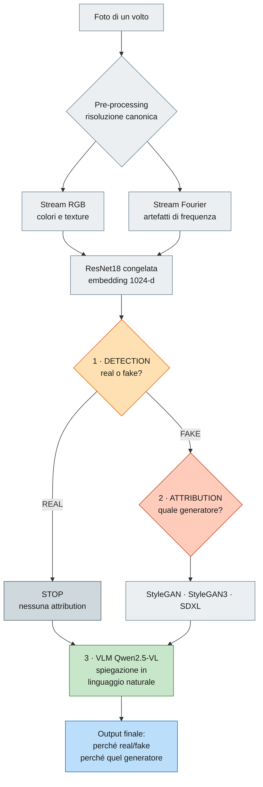
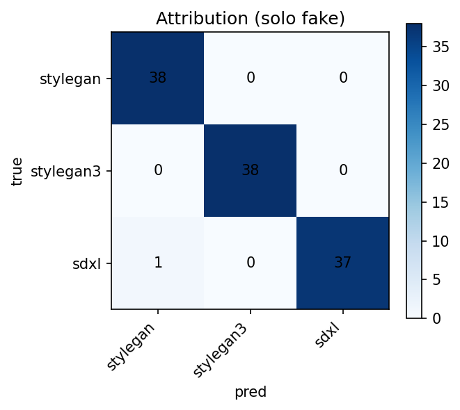
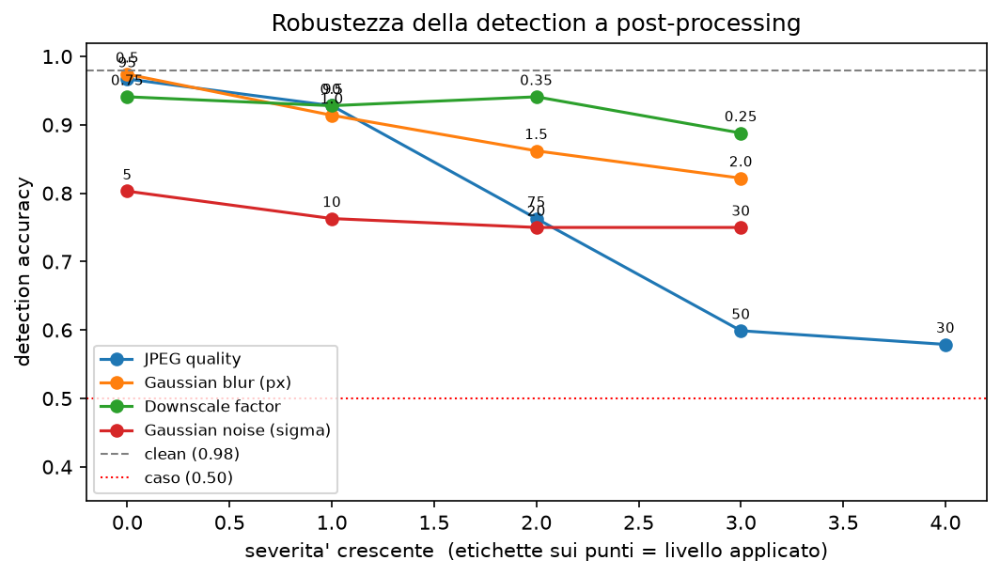

# Deepfake Detection & Attribution con Explainability multi-stream

**Corso:** Multimedia Forensics — Laurea Magistrale (II anno), A.A. 2025-26 (UniCT)
**Autore:** Giulio Pedicone
**Data:** Luglio 2026

---

## Abstract

Si presenta una pipeline forense per il **rilevamento** di volti sintetici e
l'**attribuzione** del generatore che li ha prodotti. Ogni immagine è analizzata
su due stream complementari — l'immagine RGB e lo **spettro di magnitudine della
FFT 2D** — ciascuno codificato da una ResNet18 pre-addestrata su ImageNet e
congelata; gli embedding (512+512 = 1024-d) alimentano un classificatore
multi-task con inferenza **a cascata** (detection real/fake → se *fake* →
attribution tra i generatori). Il sistema integra l'**explainability**: Grad-CAM
sui due stream e un **agent VLM open** (Qwen2.5-VL) che motiva in linguaggio
naturale il *perché* di detection e attribution. L'intero esperimento è
eseguibile gratuitamente su Google Colab (GPU T4). I risultati *in-distribution*
sono elevati (detection acc = 0.977, attribution acc sui fake = 0.991, cascade acc =
0.973; intervalli di confidenza Wilson 95% in §5) ma gli esperimenti di controllo
mostrano che dipendono in larga parte da un **confound di sorgente**: in un test
*leave-one-generator-out* la detection su un generatore mai visto crolla a 0.684 di
media, e per un generatore *diffusion* mai visto (SDXL, con addestramento sui soli
GAN) il recall sui fake precipita a **0.00**. Quando però si isola una coppia a
**sorgente condivisa** (volti reali FFHQ-256 vs SDXL generati dalla stessa base), la
detection raggiunge 0.987 e **resta invariata dopo la normalizzazione del colore**,
indicando una capacità di rilevamento *genuina* (seppur specifica per SDXL). Un test
di **robustezza a post-processing** mostra inoltre che la detection regge blur e
ridimensionamento ma **crolla sotto forte compressione JPEG** (0.56 a q30), il che ne
delimita l'uso pratico. Il contributo principale di
questo lavoro è quindi **metodologico**: identificare, misurare e discutere onestamente
tali limiti (confound di sorgente, fragilità alla compressione), isolando con un
benchmark controllato il segnale forense reale.

## 1. Introduzione

- Contesto: diffusione dei volti sintetici (StyleGAN e successori, modelli
  diffusion come SDXL) e necessità forense di **rilevarli** e **attribuirne la
  sorgente**.
- Limite degli approcci "black-box": serve **explainability** (perché real/fake,
  perché quel generatore).
- Contributo di questo lavoro: pipeline multi-stream + classificatore a cascata +
  spiegazione in linguaggio naturale tramite VLM open, interamente eseguibile
  gratis su Colab T4.

## 2. Dati

- **Reali:** FFHQ (`bitmind/ffhq-256`).
- **Fake:** StyleGAN (`34data/STYLEGAN`), StyleGAN3
  (`34data/stylegan3_T_FFHQU_processed`), SDXL — diffusion
  (`bitmind/ffhq-256___stable-diffusion-xl-base-1.0`).
- Download: subset scaricato dal *datasets-server* di HuggingFace (endpoint
  `/rows`), **500 immagini per classe** (2000 totali) nel run di riferimento.
- Pre-processing: **risoluzione canonica** (tutte le immagini portate a 256×256
  con la stessa interpolazione bicubica *prima* di RGB e Fourier, vedi §3.1) →
  resize a 224×224, normalizzazione ImageNet.
- Split **stratificato** train/val/test = 70% / 15% / 15% (seed = 42).

| Classe | Sorgente HuggingFace | Risoluzione nativa | # immagini |
|--------|----------------------|-------------------:|-----------:|
| `real`      | `bitmind/ffhq-256`                                | 256×256   | 500 |
| `stylegan`  | `34data/STYLEGAN`                                 | 1024×1024 | 500 |
| `stylegan3` | `34data/stylegan3_T_FFHQU_processed`              | 244×244   | 500 |
| `sdxl`      | `bitmind/ffhq-256___stable-diffusion-xl-base-1.0` | 256×256   | 500 |

Conteggi per split (run con `max_per_class = 500`, seed = 42 → 2000 immagini,
split 1400 / 300 / 300):

| Classe | # immagini | Train | Val | Test |
|--------|-----------:|------:|----:|-----:|
| real      | 500 | 350 | 75 | 75 |
| stylegan  | 500 | 350 | 75 | 75 |
| stylegan3 | 500 | 350 | 75 | 75 |
| sdxl      | 500 | 350 | 75 | 75 |

> **Confound della risoluzione (centrale in questo lavoro).** Le risoluzioni
> native sono eterogenee (real/sdxl 256, StyleGAN **1024**, StyleGAN3 244). Se ogni
> classe viene semplicemente portata a 224, il *fattore* di resampling — diverso per
> classe — lascia una firma che il classificatore sfrutta al posto dei veri artefatti
> generativi, **gonfiando** le metriche fino a valori irrealistici (attribution ≈
> 100%). Per neutralizzarlo applichiamo una **risoluzione canonica** (§3.1): tutte le
> immagini passano per la stessa identica catena di resize. L'effetto del confound e
> della sua rimozione è quantificato in §5.5.

## 3. Metodo

### 3.0 Panoramica del flusso

Il sistema risponde in cascata a tre domande: *vera o finta?* → (se finta) *quale
generatore?* → *perché?*. Ogni immagine è osservata su due stream complementari
(RGB e spettro di Fourier), codificati da ResNet18 congelate; la detection fa da
*gate* e l'attribution si interpreta solo sui fake; infine un VLM open motiva in
linguaggio naturale entrambe le decisioni.

Il flusso si **biforca** dopo la detection: se *real* salta l'attribution e passa
direttamente alla spiegazione; se *fake* attraversa prima l'attribution. I due rami
si ricongiungono nel VLM, che spiega le scelte fatte. I dettagli di ciascun blocco
sono nelle sottosezioni seguenti.

### 3.1 Risoluzione canonica (anti-confound)

Prima di qualunque elaborazione, **ogni** immagine — indipendentemente dalla
dimensione nativa — viene portata a `canonical_size × canonical_size` (256×256) con
la **stessa** interpolazione bicubica. Lo stesso tensore canonico alimenta sia lo
stream RGB sia lo spettro di Fourier. Questo è essenziale soprattutto per lo stream
Fourier: la FFT calcolata su una griglia 1024 (StyleGAN) è un oggetto diverso da
quella su una griglia 256 (SDXL); fissando la griglia a monte si rende lo spettro
confrontabile tra le classi e si rimuove la scorciatoia del resampling. Il
parametro è `cfg.canonical_size` (`None` = comportamento legacy, usato come termine
di paragone nell'ablation §5.5).

### 3.2 Stream RGB e Stream Fourier

Lo stream RGB lavora nel dominio spaziale (texture, artefatti semantici). Lo
stream Fourier converte l'immagine in scala di grigi, ne calcola la FFT 2D, centra
la frequenza zero (`fftshift`), prende la magnitudine in scala logaritmica
`log(1+|F|)` normalizzata in `[0,1]` e la replica su 3 canali.
**Normalizzazione robusta (`fourier_robust`).** La componente DC (frequenza 0) ha
magnitudine enorme: con un semplice min-max globale dominerebbe la scala,
comprimendo gli artefatti periodici di media/alta frequenza — proprio il segnale
forense utile. Lo spettro viene quindi clippato al 99° percentile prima di scalare,
espandendo la dinamica delle frequenze informative (l'effetto è quantificato in
§5.5b). Motivazione: le
convoluzioni trasposte / l'up-sampling dei generatori introducono **artefatti
periodici** nello spettro, spesso invisibili nel dominio spaziale ma evidenti in
frequenza. I due stream sono quindi complementari.

### 3.3 Feature extraction (ResNet18 ImageNet, congelata)

Due ResNet18 indipendenti, pre-addestrate su ImageNet e **congelate**; rimossa la
`fc`, l'output è l'embedding 512-d dopo il global average pooling. Gli embedding
dei due stream sono concatenati (1024-d). Essendo i backbone congelati, gli
embedding sono **pre-calcolati una sola volta e messi in cache** su disco: il
training del classificatore dura pochi secondi. L'indipendenza dei backbone
consente di agganciare Grad-CAM separatamente a `layer4` di ciascuno stream.

### 3.4 Classificatore a cascata

MLP con tronco condiviso (2 layer `Linear+BN+ReLU+Dropout`) e due teste lineari:

- **Detection** (2 classi): `real` vs `fake`, addestrata su *tutti* i campioni.
- **Attribution** (G classi): *solo* i generatori (`stylegan`/`stylegan3`/`sdxl`,
  **niente `real`**), addestrata sui *soli* fake.

La loss è `w_det·CE(detection) + w_attr·CE(attribution, ignore_index=-1)`: i
campioni reali (label di attribution `-1`) sono ignorati dalla loss di
attribution. L'**inferenza a cascata** decide prima la detection e interpreta
l'attribution **solo se** l'immagine è classificata *fake*; poiché l'attribution
non contiene `real`, la decisione finale non può mai essere incoerente. La
selezione del modello usa la **cascade accuracy** (end-to-end) sul validation set.

### 3.5 Explainability

**Grad-CAM** sui due stream (gradienti rispetto a `layer4`, media spaziale, ReLU,
up-sampling): RGB indica *dove* nell'immagine, Fourier *quali* regioni di
frequenza. **Agent VLM**: Qwen2.5-VL-3B (4-bit su T4) riceve immagine RGB, spettro
di Fourier e overlay Grad-CAM insieme alle probabilità del classificatore, e —
guidato da un *system prompt* da esperto forense — produce una spiegazione che
distingue la motivazione della detection da quella dell'attribution. In assenza di
GPU/modello, un generatore template-based deterministico fornisce comunque una
spiegazione coerente con le evidenze numeriche.

## 4. Setup sperimentale

- **Hardware:** Google Colab GPU T4 (16 GB).
- **Pre-processing:** risoluzione canonica `canonical_size = 256` (bicubica), poi
  224×224 + normalizzazione ImageNet. Spettro di Fourier con normalizzazione robusta
  (`fourier_robust = True`, clipping al 99° percentile).
- **Backbone:** ResNet18 (ImageNet), congelata; embedding 512+512 = 1024-d.
- **Iperparametri:** epochs = 30 (tetto; **early-stopping** con *patience* = 8 sulla
  cascade-acc di validazione), batch = 32, lr = 1e-3, weight decay = 1e-4,
  dropout = 0.3, hidden_dim = 256, `attribution_weight = detection_weight = 1.0`.
- **VLM:** `Qwen/Qwen2.5-VL-3B-Instruct`, 4-bit (nf4), `max_new_tokens = 512`.
- **Software:** PyTorch, torchvision, transformers. Seed = 42, cuDNN deterministico.

## 5. Risultati

> **Nota sulla varianza tra run.** I valori riportati provengono da un singolo run
> di riferimento. Pur fissando il seed e `cudnn.deterministic=True`, il training su
> GPU **non è perfettamente deterministico**: il flag copre le sole convoluzioni
> cuDNN, mentre altre primitive CUDA (es. riduzioni con operazioni atomiche in
> virgola mobile) restano non deterministiche. Rieseguendo la pipeline le
> metriche di detection/cascade oscillano tipicamente di alcuni punti (es. detection
> 0.95–0.98 su run diversi) e il numero di falsi positivi sui *real* varia (in alcuni
> run è zero). Le **conclusioni qualitative** del lavoro — confound di sorgente,
> crollo nel LOGO, segnale genuino nel benchmark *same-source* — sono invece **stabili**
> tra run; i decimali esatti vanno letti come rappresentativi, non riproducibili
> al millesimo.

Gli **intervalli di confidenza** riportati sono intervalli di *Wilson* al 95%,
calcolati dai conteggi del test set (n = 300 per detection e cascade; 225 per
l'attribution sui soli fake; 150 per il benchmark same-source): con campioni di queste
dimensioni le accuracy vanno lette con una banda di alcuni punti, non come valori
puntuali esatti.

### 5.1 Detection (real vs fake)

| Metrica | Valore |
|---------|-------:|
| Accuracy | **0.977** (293/300, 95% CI Wilson [0.953, 0.989]) |
| Precision (macro) | 0.97 |
| Recall (macro) | 0.97 |
| F1 (macro) | 0.97 |

Per classe (test = 75 real, 225 fake): `real` precision 0.96 / recall 0.95;
`fake` precision 0.98 / recall 0.99. Matrice di confusione: 71/75 real corretti
(4 falsi positivi), 222/225 fake corretti (3 fake scambiati per real).

### 5.2 Attribution (multi-generatore, solo sui fake)

- Accuracy (sui soli fake): **0.991** (223/225, 95% CI Wilson [0.968, 0.998]).
- Per generatore (F1): `stylegan` 0.99, `stylegan3` 0.99, `sdxl` 0.99.
- Matrice di confusione tra generatori: quasi diagonale (due soli errori, entrambi
  predetti StyleGAN: 1 StyleGAN3 → StyleGAN, 1 SDXL → StyleGAN).

- ⚠️ Questo valore è **gonfiato dal confound di sorgente** (vedi §5.5b: il solo
  stream RGB attribuisce a ~1.00) e va letto alla luce del LOGO (§5.6).

### 5.3 Cascade (end-to-end)

- Cascade accuracy (detection come gate → attribution): **0.973** (292/300, 95% CI
  Wilson [0.948, 0.986]).

### 5.4 Curve di training

La loss di training scende rapidamente verso ~0 mentre la loss di validazione si
assesta: oltre il minimo di validazione l'MLP tenderebbe a un **lieve overfitting**
(atteso, dati i ~330k parametri del classificatore contro le ~1400 immagini di
training e un validation set di 300 campioni). Due meccanismi lo controllano:
la **selezione del best-checkpoint** sulla *cascade accuracy* di validazione (si
riporta l'epoca migliore, non l'ultima) e un **early-stopping** con *patience* 8 che
interrompe il training se la cascade-acc di validazione non migliora per 8 epoche
consecutive — evitando così di addestrare nel regime in cui la val-loss risale. Nel
run di riferimento il best è all'**epoca 7** e l'early-stopping ferma il training
all'**epoca 15** (16 su 30 epoche massime); la linea tratteggiata nella figura segna
l'epoca di best/early-stop. A monte agiscono i regolarizzatori del modello (dropout
0.3, weight-decay 1e-4, BatchNorm). Le accuracy di validazione restano alte ma
rumorose per via del set contenuto.

> **Nota.** Questo *overfitting dell'MLP* è distinto — e assai meno grave — del
> **confound di sorgente** (§5.6): il primo è il divario train→val, controllato qui
> sopra; il secondo è il fatto che il modello, pur generalizzando *dentro* la sua
> distribuzione, impara la firma del dataset invece dell'artefatto generativo, e non
> si cura con la sola regolarizzazione (serve un protocollo *same-source*, §5.7).

### 5.5 Ablation — confound della risoluzione e contributo degli stream

**(a) RAW vs CANONICA.** Stessa pipeline con e senza uniformazione della
risoluzione. Il crollo dell'accuracy (in particolare dell'attribution) misura
quanto il modello "RAW" si appoggiasse al confound invece che agli artefatti reali.

| Pipeline | Detection acc | Attribution acc (fake) | Cascade acc |
|----------|--------------:|-----------------------:|------------:|
| RAW (`canonical_size=None`) | 0.987 | 1.000 | 0.987 |
| CANONICA (256) | 0.977 | 0.991 | 0.973 |

> Osservazione (dal run): l'uniformazione della risoluzione sposta **poco** le
> metriche (es. attribution 1.00 → 0.99). La risoluzione era quindi solo **uno** dei
> confound: ne restano altri correlati alla sorgente (compressione JPEG, color
> grading, pipeline del dataset). L'ablation (b) e soprattutto il LOGO (§5.6) lo
> mostrano in modo netto.

**(b) Contributo degli stream** (sui dati canonici, con normalizzazione Fourier
robusta §3.2): solo RGB, solo Fourier, entrambi.

| Stream | Detection acc | Attribution acc (fake) | Cascade acc |
|--------|--------------:|-----------------------:|------------:|
| RGB-only | 0.960 | 0.996 | 0.960 |
| Fourier-only | 0.787 | 0.880 | 0.707 |
| Both | 0.970 | 0.987 | 0.963 |

Il segnale è **dominato dall'RGB** (attribution ≈ 1.00 da solo); lo stream Fourier
— quello motivato dagli artefatti di frequenza — è nettamente il più debole. Questo
ridimensiona l'ipotesi di partenza e indica che l'RGB cattura indizi di sorgente
(colore/compressione) più che veri artefatti generativi.

> **Effetto della normalizzazione robusta dello spettro (§3.2).** Anche clippando il
> picco DC per espandere le frequenze informative, l'attribution del solo stream
> Fourier resta modesta (**0.88** da sola) e nettamente sotto l'RGB: una rappresentazione
> più pulita rende lo stream un po' più informativo, ma il miglioramento **non** si
> propaga alla generalizzazione (vedi §5.6: il LOGO non migliora). Conferma che il collo
> di bottiglia non è la rappresentazione della frequenza, ma il confound di sorgente nei dati.

### 5.6 Generalizzazione — Leave-One-Generator-Out (LOGO)

Esperimento chiave per la validità forense. Per ogni generatore `g`: detection
addestrata su `real + (altri generatori)`, testata su `real + g`. Misura se il
rilevatore generalizza a una sorgente **mai vista** o se ha solo memorizzato la
firma di ciascun dataset.

| Held-out (mai visto) | Detection acc | Recall sui fake mai visti |
|----------------------|--------------:|--------------------------:|
| StyleGAN | 0.753 | 0.613 |
| StyleGAN3 | 0.827 | 0.707 |
| SDXL | 0.473 | 0.000 |
| **media** | **0.684** | — |

Riferimento in-distribution: detection acc = 0.977. La detection **crolla a 0.684** di
media, ma il dato interessante è la sua **struttura**. Su un *GAN* mai visto il
rilevatore recupera parzialmente (recall 0.61 e 0.71 per StyleGAN e StyleGAN3): avendo
in training l'*altro* GAN, ne riconosce in parte gli artefatti condivisi. Su **SDXL**,
invece, il collasso è totale: è un modello *diffusion* mentre l'addestramento (sui soli
StyleGAN/StyleGAN3) ha visto solo *GAN* → detection 0.473 (≈ caso) e recall **0.00**, cioè
**tutti** gli SDXL classificati come reali. La generalizzazione, quindi, funziona solo
*entro la stessa famiglia* generativa (GAN→GAN) e **fallisce completamente** verso una
famiglia nuova (GAN→diffusion). È la prova diretta che le metriche in-distribution
riflettono in larga parte la memorizzazione della firma delle sorgenti note, non una
capacità generale di rilevare contenuto sintetico sconosciuto.

### 5.7 Benchmark *same-source* (real vs SDXL) — il risultato di cui ci si può fidare

Tutti gli esperimenti precedenti soffrono del fatto che *generatore* e *dataset di
origine* coincidono. Esiste però **una coppia a sorgente condivisa**: `real`
(`bitmind/ffhq-256`) e `sdxl` (`bitmind/ffhq-256___stable-diffusion-xl-base-1.0`)
provengono dalla **stessa** base FFHQ-256, con identico contenitore. Verificato sui
file: entrambe **PNG, 256×256, RGB**, dimensione media simile (90 vs 84 KB) → niente
confound banale di formato/risoluzione. La differenza dominante è quindi il *processo
generativo*. Su questa coppia la detection è molto più affidabile.

**Detection a coppie (real vs singolo generatore, test bilanciato 75+75):**

| Coppia | Detection acc | Sorgente |
|--------|--------------:|----------|
| real vs StyleGAN | 0.987 | diversa |
| real vs StyleGAN3 | 0.980 | diversa |
| **real vs SDXL** | **0.980** | **condivisa (FFHQ-256)** |

Le coppie a sorgente *diversa* (StyleGAN/StyleGAN3) sono alte anche grazie al confound
di sorgente; quella che conta è **real vs SDXL**, a sorgente *condivisa*. Analizzata in
dettaglio sul set completo bilanciato (75+75) raggiunge **0.987** (matrice di confusione
`[[74,1],[1,74]]`: due soli errori, non il sospetto diagonale perfetto dell'attribution;
95% CI Wilson [0.953, 0.996]) — è questo il valore usato per il controllo del colore qui
sotto. Ablation degli stream sulla coppia: **RGB 0.987**, Fourier 0.800, Both 0.987 → il
segnale è ancora nell'RGB.

**Controllo dei confound residui.** Anche la coppia pulita potrebbe nascondere una
differenza *a livello di set* (es. colore medio diverso). Due verifiche:

1. *Baseline banale* (solo media+std dei colori, 6 valori → regressione logistica):
   real vs SDXL = **0.807**. Esiste quindi una differenza di colore di set, ben sopra
   il caso (0.5): da sola spiega ~81%.
2. *Color-normalization* (standardizzazione per-canale di ogni immagine, che azzera
   quella differenza): la detection RGB resta a **0.987**, **invariata**.

| Condizione | Detection acc (real vs SDXL) |
|------------|-----------------------------:|
| RGB normale (ImageNet) | 0.987 |
| RGB + color-normalization | 0.987 |
| Baseline banale (solo colore) | 0.807 |

**Lettura.** La detection di SDXL **sopravvive** alla rimozione del colore: il modello
non si appoggia alla differenza di colore di set (che pure esiste, 0.81), ma a
**struttura per-immagine** — verosimilmente i veri artefatti di sintesi. Questo è
l'unico numero del lavoro che riflette una capacità forense *genuina*: con sorgente
controllata, il sistema distingue volti reali da volti SDXL al **98.7%**, in modo
robusto alla normalizzazione del colore. Resta però **specifico per SDXL**: il LOGO
(§5.6) mostra che questa capacità **non** si trasferisce a generatori mai visti.

### 5.8 Robustezza a post-processing (JPEG, blur, resize, rumore)

Le immagini reali circolano quasi sempre **ricompresse, ridimensionate o rumorose**.
Un rilevatore valutato solo su input "puliti" ne sovrastima la resa pratica. Qui il
modello del run principale (nessun riaddestramento) è valutato su un test set
**degradato**: ogni degradazione è applicata alla risoluzione **canonica (256)**, così
tutte le classi subiscono la stessa alterazione e non si reintroduce il confound di
risoluzione. Metrica: **detection accuracy** (real vs fake). Baseline pulita
attraverso la stessa pipeline: **0.977** (coincide con la detection di §5.1: la
pipeline di degradazione non introduce di per sé alcuna alterazione).

| Degradazione | Lieve | → | → | Severa |
|--------------|------:|---:|---:|------:|
| **JPEG** (quality 95→30) | 0.967 | 0.747 (q75) | 0.607 (q50) | **0.557** (q30) |
| **Blur gaussiano** (σ 0.5→2.0 px) | 0.973 | 0.913 | 0.813 | 0.763 |
| **Downscale** (fattore 0.75→0.25) | 0.930 | 0.927 | 0.903 | 0.827 |
| **Rumore gaussiano** (σ 5→30) | 0.833 | 0.767 | 0.750 | 0.747 |

**Lettura.**

- **JPEG è la minaccia principale.** A q95 la detection regge (0.967) e a q90 cede
  poco (0.940), ma sotto q75 crolla: **0.61 a q50**, **0.56 a q30**, ormai poco sopra
  il caso. La quantizzazione DCT distrugge proprio gli **artefatti periodici di alta
  frequenza** su cui si appoggia lo stream di Fourier — il segnale forense più fragile.
- **Il rumore** abbatte subito l'accuratezza ma poi **satura a ~0.75**: sporca lo
  spettro senza cancellarlo del tutto, lasciando allo stream RGB un residuo di segnale.
- **Blur** e **downscale** sono i più **tollerati**: il ridimensionamento è quasi
  innocuo (0.83–0.93) perché la pipeline già normalizza la scala; il blur degrada in
  modo graduale (fino a 0.763) senza collassi.

**Implicazione forense.** Il sistema è utilizzabile su materiale di buona qualità
(JPEG ≥ q90, ridimensionato) ma **non** è affidabile su immagini fortemente
ricompresse — lo scenario tipico dei social. La contromisura standard è la **JPEG
augmentation in training** (ricompressione casuale delle immagini durante
l'addestramento), non applicata qui: è il naturale sviluppo futuro (§8).

> *Nota.* I valori provengono dallo stesso run definitivo delle sezioni precedenti
> (notebook, sezione 7-quinquies): la baseline pulita coincide infatti con la
> detection di §5.1 (0.977). Vale comunque la nota all'inizio di §5 sulla varianza
> tra run: ciò che conta è il **calo relativo**, stabile — il profilo
> JPEG-fragile / resize-robusto è la conclusione qualitativa.

## 6. Analisi qualitativa dell'explainability

Per un campione di test si riportano immagine RGB, spettro di Fourier, overlay
Grad-CAM (figura) e la spiegazione generata dall'agent VLM (`source = vlm`). Le
citazioni sono **verbatim** dall'output del notebook (tagli indicati con […]);
si noti che il modello usa impropriamente *«certificazione»* per *confidenza* —
un artefatto linguistico del VLM, lasciato intatto per fedeltà.

### Esempio FAKE correttamente rilevato (attribuito a StyleGAN)

Il volto è **fotorealistico**: a occhio non si distinguono artefatti di sintesi. Il
Grad-CAM si concentra sul viso (pelle, occhi); lo spettro di Fourier mostra il tipico
picco centrale, senza griglie periodiche evidenti. Questo è coerente con il risultato
chiave del lavoro: la decisione **non** poggia su artefatti percepibili, ma su indizi
di sorgente non visibili. L'agent VLM — col prompt cauto — arriva alla stessa
conclusione, pur con qualche imprecisione:

> «L'immagine originale mostra una persona con capelli scuri e una pelle chiara. La sua
> espressione è calma e sorride leggermente. […] Le predizioni del classificatore
> indicano che l'immagine è "fake" con una certificazione del 100%. […] L'attribuzione
> al generatore indica che l'immagine è stata generata dal generatore StyleGAN, con una
> certificazione del 100%. **Non sono presenti griglie periodiche o artefatti visibili**
> come sfumature o contrasti anomali. Tuttavia, non è possibile escludere che il modello
> possa basarsi su indizi non visibili a occhio, come statistiche di colore o
> compressione […].» *(fonte: Qwen2.5-VL)*

La fedeltà è qui **adeguata ma non perfetta**: nel commentare lo spettro l'agent
*specula* che l'immagine "sia stata generata da un sistema che utilizza tecniche di
generazione di immagini" (inferenza non supportata dai dati visibili), ma poi si
corregge riconoscendo l'**assenza di artefatti visibili** e citando esplicitamente gli
indizi di sorgente — in linea con l'ablation (§5.5b) e il LOGO (§5.6). Si confronti con
una versione precedente del prompt, che invece affermava con sicurezza "griglie
periodiche e picchi di frequenza tipici delle GAN" — un esempio concreto di spiegazione
*non fedele* indotta da un prompt che dà per scontati gli artefatti.

### Esempio REAL correttamente classificato

Immagine reale (FFHQ) classificata correttamente `real`, con confidenza **70.8%**
(p_fake = 29.2%): corretta ma non nettissima, a conferma che il confine real/fake non è
sempre marcato. Essendo *real*, la cascata non procede all'attribution (non
applicabile). Il Grad-CAM si concentra sulla testa e lo spettro non mostra strutture
periodiche. La spiegazione VLM resta cauta e non forza la presenza di artefatti:

> «L'immagine originale mostra una persona con capelli scuri e un sorriso. Il spettro di
> Fourier non evidenzia particolari artefatti o incoerenze significative. La mappa
> Grad-CAM mostra una concentrazione di colori gialli e arancioni intorno alla testa
> della persona […]. Le predizioni del classificatore indicano una forte probabilità che
> l'immagine sia reale, con una confidenza del 70,77%. Tuttavia, dato che l'immagine è
> stata classificata come reale, non è possibile attribuire alcuna responsabilità al
> generatore senza ulteriori informazioni.» *(fonte: Qwen2.5-VL)*

### Caso al limite: un falso positivo (e un'allucinazione del VLM)

Immagine **reale** (FFHQ) classificata erroneamente `fake` — un **falso positivo** — con
p_fake = **84.7%**, attribuita a StyleGAN3 (99.9%). Nell'immagine RGB non c'è **nulla di
visibilmente sintetico**: è un volto reale (una donna coi capelli castani), senza artefatti
percepibili. L'errore nasce quindi dalle solite statistiche di colore/sorgente invisibili
(§5.5b, §5.7), non da un difetto osservabile.

Questo esempio è però prezioso per un **secondo** motivo: mostra un **fallimento di
fedeltà** dell'agent VLM. Richiesto di spiegare, il modello *inventa* un artefatto visibile
per giustificare l'etichetta:

> «L'immagine originale mostra una persona con capelli biondi e occhi azzurri, sorridendo.
> Il suo viso è parzialmente coperto da una **colorazione arcobaleno**, che sembra essere
> stata applicata tramite un effetto digitale. […] Le predizioni del classificatore indicano
> che l'immagine è "fake" con una certificazione del 84,66% […]. La colorazione arcobaleno
> può essere considerata un artefatto tipico delle immagini digitalmente modificate […].»
> *(fonte: Qwen2.5-VL)*

Confrontando con la figura, la descrizione è **falsa**: la donna ha i capelli **castani**,
non biondi, e **non** c'è alcun filtro arcobaleno sul volto. Con ogni probabilità l'agent
ha interpretato i colori della **colormap "jet" del Grad-CAM** (blu-verde-rosso, terzo
pannello) come una colorazione applicata al viso, costruendoci sopra una spiegazione
plausibile ma inventata. È l'illustrazione concreta del rischio degli explainer generativi
(§7): una spiegazione *fluente e convincente* può essere **infedele** e va sempre verificata
contro l'evidenza. In questo singolo caso convivono due fallimenti distinti — quello del
**classificatore** (che reagisce a statistiche di sorgente, non alla vera "fakeness", come
smascherato dal LOGO §5.6) e quello dell'**explainer** (che allucina un artefatto per
razionalizzare l'errore).

> **Riproducibilità.** Il confine real/fake è sensibile alla varianza tra run (§5): la
> cella del notebook che seleziona questo esempio usa un **falso positivo** se presente
> nel test (come in questo run), altrimenti ripiega sul *real più vicino alla soglia*.

## 7. Discussione

- **Risultato principale (onesto).** Le metriche in-distribution sono alte
  (detection ≈ 0.98, attribution ≈ 0.99) ma **non vanno interpretate come reale
  capacità forense**: gli esperimenti di controllo mostrano che derivano in larga
  parte da un **confound di sorgente**. Nel nostro dataset *generatore* e *dataset di
  origine* sono perfettamente correlati (ogni classe = un dataset HF distinto, con la
  sua compressione, risoluzione e color pipeline), quindi il modello può separare le
  classi dalla "firma" della sorgente anziché dagli artefatti generativi.
- **Contributo degli stream (§5.5b).** Il segnale è dominato dallo stream **RGB**
  (attribution ≈ 1.00 da solo), mentre lo stream **Fourier** — quello motivato dagli
  artefatti di frequenza — è il più debole. La normalizzazione robusta dello spettro
  (§3.2) lo lascia comunque modesto (attr Fourier-only ≈ 0.88 da solo) e non
  sposta la generalizzazione. Questo ridimensiona l'ipotesi di partenza e suggerisce
  che l'RGB sta catturando indizi di sorgente (colore/compressione).
- **Generalizzazione (§5.6, LOGO).** Su un generatore mai visto la detection
  **crolla** rispetto all'in-distribution: prova diretta che il rilevatore non
  generalizza alla "fakeness" in senso lato, ma memorizza le sorgenti note.
- **Segnale genuino su sorgente controllata (§5.7).** Il rovescio positivo: sulla
  coppia same-source real vs SDXL la detection è 0.987 e **resta invariata dopo la
  color-normalization**, mentre una baseline di solo colore si ferma a 0.81. Quindi,
  *a parità di sorgente*, il modello sfrutta artefatti di sintesi reali, non la firma
  del dataset. È la prova che il problema non è il modello ma il **disegno dei dati**:
  controllando la sorgente, una capacità forense autentica emerge (per quanto specifica
  per SDXL).
- **Confound della risoluzione (§5.5a).** Identificato e mitigato con la risoluzione
  canonica (§3.1), ma da solo sposta poco le metriche: era una delle cause, non
  l'unica.
- **Robustezza a post-processing (§5.8).** La detection tollera blur e ridimensionamento
  ma è **fragile alla compressione JPEG**: crolla da 0.98 a **0.56 a q30**, perché la
  quantizzazione DCT cancella gli artefatti di alta frequenza. Delimita l'uso pratico
  (materiale poco compresso) e indica la JPEG-augmentation come priorità.
- **Fedeltà del VLM (limite reale, osservato).** Il *system prompt* cauto riduce le
  invenzioni sugli *artefatti di frequenza* (l'agent cita la possibilità di indizi di
  sorgente non visibili, coerente con ablation e LOGO) ma **non le elimina**: nel run di
  riferimento, spiegando un falso positivo, l'agent ha *allucinato* una "colorazione
  arcobaleno" sul volto — in realtà i colori della colormap del Grad-CAM (§6). È la
  conferma concreta che la fedeltà degli explainer generativi va **verificata contro
  l'evidenza**, caso per caso: una spiegazione fluente e convincente può essere falsa.
- **Altri limiti:** dimensione contenuta del dataset; un solo dominio (volti);
  fedeltà delle spiegazioni del VLM da verificare (rischio di artefatti "plausibili"
  ma non reali).

## 8. Conclusioni e sviluppi futuri

Abbiamo realizzato una pipeline completa di detection + attribution a cascata con
explainability (Grad-CAM + agent VLM), eseguibile gratuitamente su Colab T4. I
risultati in-distribution sono elevati (detection 0.977, attribution 0.991), ma
l'analisi critica — risoluzione canonica, ablation degli stream e soprattutto il test
*leave-one-generator-out* — dimostra che tali valori sono in gran parte un artefatto
del **confound di sorgente**: nel dataset i generatori coincidono con dataset di
origine distinti, e il modello ne memorizza la firma invece di apprendere la
"sinteticità" in generale. Su un generatore mai visto la detection scende a 0.684 di
media, con recall **0.00** sul solo SDXL (diffusion, mai visto in training). Il
rovescio positivo è il **benchmark same-source** (§5.7):
isolando la coppia real vs SDXL (stessa base FFHQ-256), la detection raggiunge 0.987
e **sopravvive alla normalizzazione del colore**, prova che — a parità di sorgente —
il modello coglie artefatti di sintesi genuini, non solo la firma del dataset. Un
test di **robustezza** (§5.8) completa il quadro: la detection tollera blur e resize
ma è fragile alla forte compressione JPEG (0.56 a q30), delimitandone l'uso pratico.
Il valore del lavoro è quindi metodologico: mostrare come si
smaschera un risultato troppo bello per essere vero.

**Sviluppi futuri.** (i) Un benchmark *controllato* in cui i fake siano generati
dalla **stessa** pipeline a partire dagli stessi reali (per scorporare generatore e
sorgente); (ii) normalizzazione aggressiva (ricompressione JPEG uniforme, color
matching) e augmentation che rompano le firme di sorgente; (iii) **JPEG-augmentation
in training** (ricompressione casuale delle immagini) per irrobustire la detection
alla compressione, il punto debole emerso in §5.8; (iv) fine-tuning leggero (LoRA) dei
backbone e calibrazione della confidenza; (v) protocollo di valutazione *cross-source*
come metrica primaria al posto dell'accuracy in-distribution.

## Riferimenti

- Karras et al., *A Style-Based Generator Architecture for GANs* (StyleGAN), CVPR 2019.
- Karras et al., *Alias-Free GAN* (StyleGAN3), NeurIPS 2021.
- Podell et al., *SDXL: Improving Latent Diffusion Models for High-Resolution Image Synthesis*, 2023.
- Wang et al., *CNN-generated images are surprisingly easy to spot... for now*, CVPR 2020.
- Frank et al., *Leveraging Frequency Analysis for Deep Fake Image Recognition*, ICML 2020.
- Selvaraju et al., *Grad-CAM: Visual Explanations from Deep Networks*, ICCV 2017.
- Bai et al., *Qwen2.5-VL Technical Report*, 2025.
