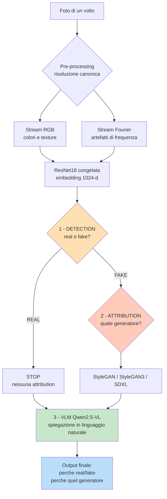
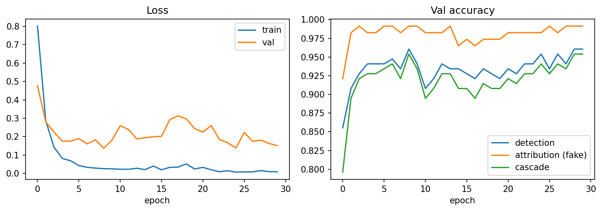
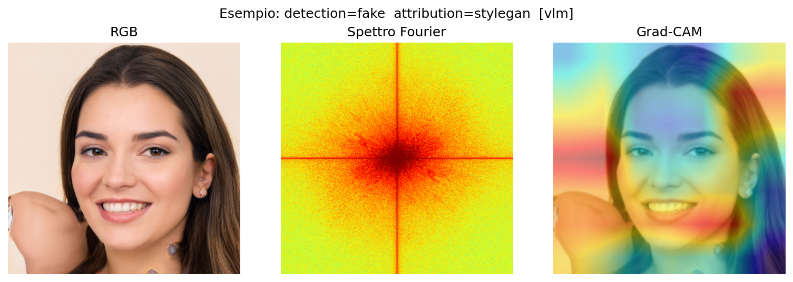
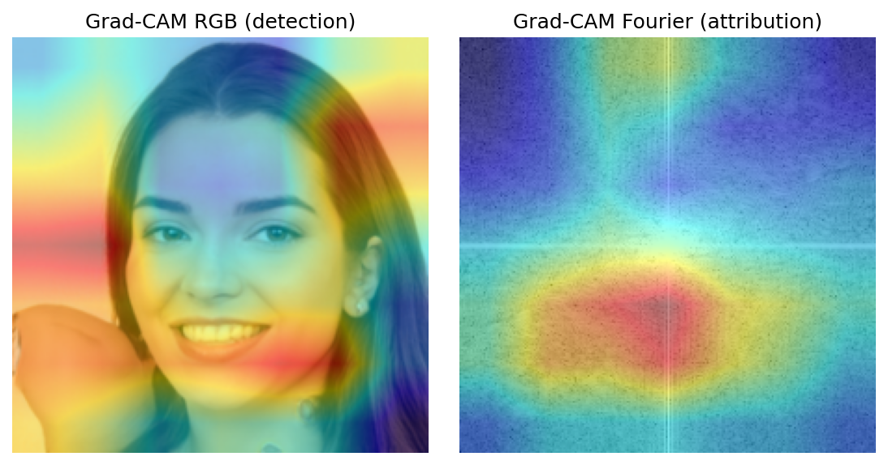
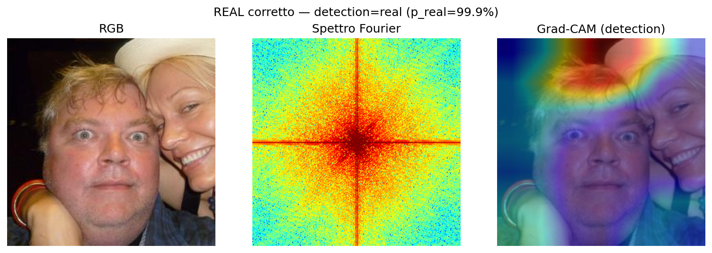
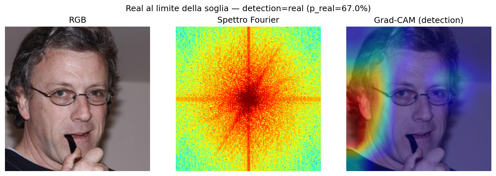

# Deepfake Detection & Attribution con Explainability multi-stream

**Corso:** Multimedia Forensics — Laurea Magistrale (II anno), A.A. 2025-26 (UniCT)
**Autore:** Giulio Pedicone
**Data:** Giugno 2026

---

## Abstract

Si presenta una pipeline forense per il **rilevamento** di volti sintetici e
l'**attribuzione** del generatore che li ha prodotti. Ogni immagine è analizzata
su due stream complementari — l'immagine RGB e lo **spettro di magnitudine della
FFT 2D** — ciascuno codificato da una ResNet18 pre-addestrata su ImageNet e
congelata; gli embedding (512+512 = 1024-d) alimentano un classificatore
multi-task con inferenza **a cascata** (detection real/fake → se *fake* →
attribution tra i generatori). Il sistema integra l'**explainability**: Grad-CAM
sui due stream e un **agent VLM open** (Qwen2.5-VL) che motiva in linguaggio
naturale il *perché* di detection e attribution. L'intero esperimento è
eseguibile gratuitamente su Google Colab (GPU T4). I risultati *in-distribution*
sono elevati (detection acc = 0.980, attribution acc sui fake = 0.991, cascade acc =
0.974) ma gli esperimenti di controllo mostrano che dipendono in larga parte da un
**confound di sorgente**: in un test *leave-one-generator-out* la detection su un
generatore mai visto crolla a 0.548 di media (recall sui fake nuovi fino a 0.00 per
SDXL). Quando però si isola una coppia a **sorgente condivisa** (volti reali FFHQ-256
vs SDXL generati dalla stessa base), la detection raggiunge 0.987 e **resta invariata
dopo la normalizzazione del colore**, indicando una capacità di rilevamento *genuina*
(seppur specifica per SDXL). Il contributo principale di questo lavoro è quindi
**metodologico**: identificare, misurare e discutere onestamente tale confound,
isolando con un benchmark controllato il segnale forense reale.

## 1. Introduzione

- Contesto: diffusione dei volti sintetici (StyleGAN e successori, modelli
  diffusion come SDXL) e necessità forense di **rilevarli** e **attribuirne la
  sorgente**.
- Limite degli approcci "black-box": serve **explainability** (perché real/fake,
  perché quel generatore).
- Contributo di questo lavoro: pipeline multi-stream + classificatore a cascata +
  spiegazione in linguaggio naturale tramite VLM open, interamente eseguibile
  gratis su Colab T4.

## 2. Dati

- **Reali:** FFHQ (`bitmind/ffhq-256`).
- **Fake:** StyleGAN (`34data/STYLEGAN`), StyleGAN3
  (`34data/stylegan3_T_FFHQU_processed`), SDXL — diffusion
  (`bitmind/ffhq-256___stable-diffusion-xl-base-1.0`).
- Download: subset scaricato dal *datasets-server* di HuggingFace (endpoint
  `/rows`), **300 immagini per classe disponibili in locale** (1200 totali).
- Pre-processing: **risoluzione canonica** (tutte le immagini portate a 256×256
  con la stessa interpolazione bicubica *prima* di RGB e Fourier, vedi §3.1) →
  resize a 224×224, normalizzazione ImageNet.
- Split **stratificato** train/val/test = 70% / 15% / 15% (seed = 42).

| Classe | Sorgente HuggingFace | Risoluzione nativa | # immagini |
|--------|----------------------|-------------------:|-----------:|
| `real`      | `bitmind/ffhq-256`                                | 256×256   | 300 |
| `stylegan`  | `34data/STYLEGAN`                                 | 1024×1024 | 300 |
| `stylegan3` | `34data/stylegan3_T_FFHQU_processed`              | 244×244   | 300 |
| `sdxl`      | `bitmind/ffhq-256___stable-diffusion-xl-base-1.0` | 256×256   | 300 |

Conteggi per split (run con `max_per_class = 250`, seed = 42 → 1000 immagini,
split 696 / 152 / 152):

| Classe | # immagini | Train | Val | Test |
|--------|-----------:|------:|----:|-----:|
| real      | 250 | 174 | 38 | 38 |
| stylegan  | 250 | 174 | 38 | 38 |
| stylegan3 | 250 | 174 | 38 | 38 |
| sdxl      | 250 | 174 | 38 | 38 |

> **Confound della risoluzione (centrale in questo lavoro).** Le risoluzioni
> native sono eterogenee (real/sdxl 256, StyleGAN **1024**, StyleGAN3 244). Se ogni
> classe viene semplicemente portata a 224, il *fattore* di resampling — diverso per
> classe — lascia una firma che il classificatore sfrutta al posto dei veri artefatti
> generativi, **gonfiando** le metriche fino a valori irrealistici (attribution ≈
> 100%). Per neutralizzarlo applichiamo una **risoluzione canonica** (§3.1): tutte le
> immagini passano per la stessa identica catena di resize. L'effetto del confound e
> della sua rimozione è quantificato in §5.5.

## 3. Metodo

### 3.0 Panoramica del flusso

Il sistema risponde in cascata a tre domande: *vera o finta?* → (se finta) *quale
generatore?* → *perché?*. Ogni immagine è osservata su due stream complementari
(RGB e spettro di Fourier), codificati da ResNet18 congelate; la detection fa da
*gate* e l'attribution si interpreta solo sui fake; infine un VLM open motiva in
linguaggio naturale entrambe le decisioni.

Il flusso si **biforca** dopo la detection: se *real* salta l'attribution e passa
direttamente alla spiegazione; se *fake* attraversa prima l'attribution. I due rami
si ricongiungono nel VLM, che spiega le scelte fatte. I dettagli di ciascun blocco
sono nelle sottosezioni seguenti.

### 3.1 Risoluzione canonica (anti-confound)

Prima di qualunque elaborazione, **ogni** immagine — indipendentemente dalla
dimensione nativa — viene portata a `canonical_size × canonical_size` (256×256) con
la **stessa** interpolazione bicubica. Lo stesso tensore canonico alimenta sia lo
stream RGB sia lo spettro di Fourier. Questo è essenziale soprattutto per lo stream
Fourier: la FFT calcolata su una griglia 1024 (StyleGAN) è un oggetto diverso da
quella su una griglia 256 (SDXL); fissando la griglia a monte si rende lo spettro
confrontabile tra le classi e si rimuove la scorciatoia del resampling. Il
parametro è `cfg.canonical_size` (`None` = comportamento legacy, usato come termine
di paragone nell'ablation §5.5).

### 3.2 Stream RGB e Stream Fourier

Lo stream RGB lavora nel dominio spaziale (texture, artefatti semantici). Lo
stream Fourier converte l'immagine in scala di grigi, ne calcola la FFT 2D, centra
la frequenza zero (`fftshift`), prende la magnitudine in scala logaritmica
`log(1+|F|)` normalizzata in `[0,1]` e la replica su 3 canali.
**Normalizzazione robusta (`fourier_robust`).** La componente DC (frequenza 0) ha
magnitudine enorme: con un semplice min-max globale dominerebbe la scala,
comprimendo gli artefatti periodici di media/alta frequenza — proprio il segnale
forense utile. Lo spettro viene quindi clippato al 99° percentile prima di scalare,
espandendo la dinamica delle frequenze informative (l'effetto è quantificato in
§5.5b). Motivazione: le
convoluzioni trasposte / l'up-sampling dei generatori introducono **artefatti
periodici** nello spettro, spesso invisibili nel dominio spaziale ma evidenti in
frequenza. I due stream sono quindi complementari.

### 3.3 Feature extraction (ResNet18 ImageNet, congelata)

Due ResNet18 indipendenti, pre-addestrate su ImageNet e **congelate**; rimossa la
`fc`, l'output è l'embedding 512-d dopo il global average pooling. Gli embedding
dei due stream sono concatenati (1024-d). Essendo i backbone congelati, gli
embedding sono **pre-calcolati una sola volta e messi in cache** su disco: il
training del classificatore dura pochi secondi. L'indipendenza dei backbone
consente di agganciare Grad-CAM separatamente a `layer4` di ciascuno stream.

### 3.4 Classificatore a cascata

MLP con tronco condiviso (2 layer `Linear+BN+ReLU+Dropout`) e due teste lineari:

- **Detection** (2 classi): `real` vs `fake`, addestrata su *tutti* i campioni.
- **Attribution** (G classi): *solo* i generatori (`stylegan`/`stylegan3`/`sdxl`,
  **niente `real`**), addestrata sui *soli* fake.

La loss è `w_det·CE(detection) + w_attr·CE(attribution, ignore_index=-1)`: i
campioni reali (label di attribution `-1`) sono ignorati dalla loss di
attribution. L'**inferenza a cascata** decide prima la detection e interpreta
l'attribution **solo se** l'immagine è classificata *fake*; poiché l'attribution
non contiene `real`, la decisione finale non può mai essere incoerente. La
selezione del modello usa la **cascade accuracy** (end-to-end) sul validation set.

### 3.5 Explainability

**Grad-CAM** sui due stream (gradienti rispetto a `layer4`, media spaziale, ReLU,
up-sampling): RGB indica *dove* nell'immagine, Fourier *quali* regioni di
frequenza. **Agent VLM**: Qwen2.5-VL-3B (4-bit su T4) riceve immagine RGB, spettro
di Fourier e overlay Grad-CAM insieme alle probabilità del classificatore, e —
guidato da un *system prompt* da esperto forense — produce una spiegazione che
distingue la motivazione della detection da quella dell'attribution. In assenza di
GPU/modello, un generatore template-based deterministico fornisce comunque una
spiegazione coerente con le evidenze numeriche.

## 4. Setup sperimentale

- **Hardware:** Google Colab GPU T4 (16 GB).
- **Pre-processing:** risoluzione canonica `canonical_size = 256` (bicubica), poi
  224×224 + normalizzazione ImageNet. Spettro di Fourier con normalizzazione robusta
  (`fourier_robust = True`, clipping al 99° percentile).
- **Backbone:** ResNet18 (ImageNet), congelata; embedding 512+512 = 1024-d.
- **Iperparametri:** epochs = 30, batch = 32, lr = 1e-3, weight decay = 1e-4,
  dropout = 0.3, hidden_dim = 256, `attribution_weight = detection_weight = 1.0`.
- **VLM:** `Qwen/Qwen2.5-VL-3B-Instruct`, 4-bit (nf4), `max_new_tokens = 512`.
- **Software:** PyTorch, torchvision, transformers. Seed = 42, cuDNN deterministico.

## 5. Risultati

> **Nota sulla varianza tra run.** I valori riportati provengono da un singolo run
> di riferimento. Pur fissando il seed, il training su GPU **non è perfettamente
> deterministico** (kernel cuDNN non deterministici): rieseguendo la pipeline le
> metriche di detection/cascade oscillano tipicamente di alcuni punti (es. detection
> 0.95–0.98 su run diversi) e il numero di falsi positivi sui *real* varia (in alcuni
> run è zero). Le **conclusioni qualitative** del lavoro — confound di sorgente,
> crollo nel LOGO, segnale genuino nel benchmark *same-source* — sono invece **stabili**
> tra run; i decimali esatti vanno letti come rappresentativi, non riproducibili
> al millesimo.

### 5.1 Detection (real vs fake)

| Metrica | Valore |
|---------|-------:|
| Accuracy | 0.980 |
| Precision (macro) | 0.96 |
| Recall (macro) | 0.99 |
| F1 (macro) | 0.97 |

Per classe (test = 38 real, 114 fake): `real` precision 0.93 / recall 1.00;
`fake` precision 1.00 / recall 0.97. Matrice di confusione: 38/38 real corretti
(0 falsi positivi), 111/114 fake corretti (3 fake scambiati per real).

### 5.2 Attribution (multi-generatore, solo sui fake)

- Accuracy (sui soli fake): **0.991** (113/114).
- Per generatore (F1): `stylegan` 0.99, `stylegan3` 1.00, `sdxl` 0.99.
- Matrice di confusione tra generatori: quasi diagonale (un solo errore, 1 SDXL → StyleGAN).
- ⚠️ Questo valore è **gonfiato dal confound di sorgente** (vedi §5.5b: il solo
  stream RGB attribuisce a ~1.00) e va letto alla luce del LOGO (§5.6).

### 5.3 Cascade (end-to-end)

- Cascade accuracy (detection come gate → attribution): **0.974**.

### 5.4 Curve di training

La loss di training scende rapidamente verso ~0 mentre la loss di validazione si
assesta e poi risale leggermente dopo l'epoca ~10: segno di un **lieve overfitting**
del classificatore MLP (atteso, dato il validation set ridotto, 152 campioni, e gli
embedding congelati). La selezione del modello sulla *cascade accuracy* di
validazione mitiga l'effetto. Le accuracy di validazione sono alte ma rumorose.

### 5.5 Ablation — confound della risoluzione e contributo degli stream

**(a) RAW vs CANONICA.** Stessa pipeline con e senza uniformazione della
risoluzione. Il crollo dell'accuracy (in particolare dell'attribution) misura
quanto il modello "RAW" si appoggiasse al confound invece che agli artefatti reali.

| Pipeline | Detection acc | Attribution acc (fake) | Cascade acc |
|----------|--------------:|-----------------------:|------------:|
| RAW (`canonical_size=None`) | 0.987 | 1.000 | 0.987 |
| CANONICA (256) | 0.980 | 0.991 | 0.974 |

> Osservazione (dal run): l'uniformazione della risoluzione sposta **poco** le
> metriche (es. attribution 1.00 → 0.99). La risoluzione era quindi solo **uno** dei
> confound: ne restano altri correlati alla sorgente (compressione JPEG, color
> grading, pipeline del dataset). L'ablation (b) e soprattutto il LOGO (§5.6) lo
> mostrano in modo netto.

**(b) Contributo degli stream** (sui dati canonici, con normalizzazione Fourier
robusta §3.2): solo RGB, solo Fourier, entrambi.

| Stream | Detection acc | Attribution acc (fake) | Cascade acc |
|--------|--------------:|-----------------------:|------------:|
| RGB-only | 0.961 | 1.000 | 0.961 |
| Fourier-only | 0.776 | 0.904 | 0.711 |
| Both | 0.947 | 0.991 | 0.941 |

Il segnale è **dominato dall'RGB** (attribution ≈ 1.00 da solo); lo stream Fourier
— quello motivato dagli artefatti di frequenza — è nettamente il più debole. Questo
ridimensiona l'ipotesi di partenza e indica che l'RGB cattura indizi di sorgente
(colore/compressione) più che veri artefatti generativi.

> **Effetto della normalizzazione robusta dello spettro (§3.2).** Anche clippando il
> picco DC per espandere le frequenze informative, l'attribution del solo stream
> Fourier resta modesta (**0.90** da sola) e nettamente sotto l'RGB: una rappresentazione
> più pulita rende lo stream un po' più informativo, ma il miglioramento **non** si
> propaga alla generalizzazione (vedi §5.6: il LOGO non migliora). Conferma che il collo
> di bottiglia non è la rappresentazione della frequenza, ma il confound di sorgente nei dati.

### 5.6 Generalizzazione — Leave-One-Generator-Out (LOGO)

Esperimento chiave per la validità forense. Per ogni generatore `g`: detection
addestrata su `real + (altri generatori)`, testata su `real + g`. Misura se il
rilevatore generalizza a una sorgente **mai vista** o se ha solo memorizzato la
firma di ciascun dataset.

| Held-out (mai visto) | Detection acc | Recall sui fake mai visti |
|----------------------|--------------:|--------------------------:|
| StyleGAN | 0.539 | 0.079 |
| StyleGAN3 | 0.618 | 0.289 |
| SDXL | 0.487 | 0.000 |
| **media** | **0.548** | — |

Riferimento in-distribution: detection acc = 0.980. La detection **crolla a 0.548**
(vicino al caso, dato che il test è ~50% real / 50% fake) e il **recall sui fake mai
visti precipita**: 0.08, 0.29 e **0.00** per SDXL. Il caso SDXL è il più indicativo:
è un modello *diffusion*, mentre l'addestramento (sui soli StyleGAN/StyleGAN3) ha
visto solo *GAN* → il rilevatore classifica **tutti** gli SDXL come reali. È la prova
diretta che le metriche in-distribution riflettono la memorizzazione della firma
delle sorgenti note, non una reale capacità di rilevare contenuto sintetico
sconosciuto.

### 5.7 Benchmark *same-source* (real vs SDXL) — il risultato di cui ci si può fidare

Tutti gli esperimenti precedenti soffrono del fatto che *generatore* e *dataset di
origine* coincidono. Esiste però **una coppia a sorgente condivisa**: `real`
(`bitmind/ffhq-256`) e `sdxl` (`bitmind/ffhq-256___stable-diffusion-xl-base-1.0`)
provengono dalla **stessa** base FFHQ-256, con identico contenitore. Verificato sui
file: entrambe **PNG, 256×256, RGB**, dimensione media simile (90 vs 84 KB) → niente
confound banale di formato/risoluzione. La differenza dominante è quindi il *processo
generativo*. Su questa coppia la detection è molto più affidabile.

**Detection a coppie (real vs singolo generatore, test bilanciato 38+38):**

| Coppia | Detection acc | Sorgente |
|--------|--------------:|----------|
| real vs StyleGAN | 0.961 | diversa |
| real vs StyleGAN3 | 0.961 | diversa |
| **real vs SDXL** | **0.987** | **condivisa (FFHQ-256)** |

La coppia pulita real vs SDXL raggiunge **0.987** (matrice di confusione `[[38,0],[1,37]]`:
un solo errore reale, non il sospetto diagonale perfetto dell'attribution). Ablation
degli stream sulla coppia: **RGB 0.987**, Fourier 0.711, Both 0.987 → il segnale è
ancora nell'RGB.

**Controllo dei confound residui.** Anche la coppia pulita potrebbe nascondere una
differenza *a livello di set* (es. colore medio diverso). Due verifiche:

1. *Baseline banale* (solo media+std dei colori, 6 valori → regressione logistica):
   real vs SDXL = **0.763**. Esiste quindi una differenza di colore di set, ben sopra
   il caso (0.5): da sola spiega ~76%.
2. *Color-normalization* (standardizzazione per-canale di ogni immagine, che azzera
   quella differenza): la detection RGB resta a **0.987**, **invariata**.

| Condizione | Detection acc (real vs SDXL) |
|------------|-----------------------------:|
| RGB normale (ImageNet) | 0.987 |
| RGB + color-normalization | 0.987 |
| Baseline banale (solo colore) | 0.763 |

**Lettura.** La detection di SDXL **sopravvive** alla rimozione del colore: il modello
non si appoggia alla differenza di colore di set (che pure esiste, 0.76), ma a
**struttura per-immagine** — verosimilmente i veri artefatti di sintesi. Questo è
l'unico numero del lavoro che riflette una capacità forense *genuina*: con sorgente
controllata, il sistema distingue volti reali da volti SDXL al **98.7%**, in modo
robusto alla normalizzazione del colore. Resta però **specifico per SDXL**: il LOGO
(§5.6) mostra che questa capacità **non** si trasferisce a generatori mai visti.

## 6. Analisi qualitativa dell'explainability

Per un campione di test si riportano immagine RGB, spettro di Fourier, overlay
Grad-CAM (figura) e la spiegazione generata dall'agent VLM (`source = vlm`).

### Esempio FAKE correttamente rilevato (attribuito a StyleGAN)

Il volto è **fotorealistico**: a occhio non si distinguono artefatti di sintesi. Il
Grad-CAM si concentra su viso e orecchie; lo spettro di Fourier mostra il tipico
picco centrale, senza griglie periodiche evidenti. Questo è coerente con il risultato
chiave del lavoro: la decisione **non** poggia su artefatti percepibili, ma su indizi
di sorgente non visibili. Notevolmente, l'agent VLM — col prompt cauto — **non
inventa** artefatti e arriva alla stessa conclusione:

> «L'immagine originale mostra una persona con capelli lunghi e una maglietta gialla.
> La mappa Grad-CAM evidenzia le zone più importanti per il classificatore,
> concentrandosi sul viso e sulle orecchie della persona. Le predizioni del
> classificatore indicano che l'immagine è falsa con una certezza del 99,95% […].
> **Non sono presenti griglie periodiche o incoerenze di texture che potrebbero
> suggerire artefatti.** […] Il modello potrebbe basarsi su indizi di sorgente non
> visibili a occhio, come statistiche di colore, compressione o risoluzione legate
> alla sorgente dei dati.» *(fonte: Qwen2.5-VL)*

La fedeltà della spiegazione è qui **adeguata**: l'agent riconosce l'assenza di
artefatti visibili e cita esplicitamente gli indizi di sorgente, in linea con
l'ablation (§5.5b) e il LOGO (§5.6). Si confronti con una versione precedente del
prompt, che invece affermava con sicurezza "griglie periodiche e picchi di frequenza
tipici delle GAN" — un esempio concreto di spiegazione *non fedele* indotta da un
prompt che dà per scontati gli artefatti.

### Esempio REAL correttamente classificato

Immagine reale (FFHQ) classificata `real` con confidenza **99.90%** (p_fake = 0.10%).
Essendo *real*, la cascata non procede all'attribution (non applicabile). Il Grad-CAM
si concentra sui volti e lo spettro non mostra strutture periodiche. La spiegazione
VLM resta cauta e non forza la presenza di artefatti:

> «L'immagine originale mostra una coppia in posizione abbracciata. Il spettro di
> Fourier non evidenzia particolari artefatti o incoerenze […]. La predizione del
> classificatore è stata classificata come "real" con una certezza molto alta (0.999)
> […]. Questo suggerisce che l'immagine sia verosimilmente reale, ma non esclude
> completamente la possibilità di artefatti invisibili o di indizi non visibili.»
> *(fonte: Qwen2.5-VL)*

### Caso al limite della soglia

Immagine **reale** classificata correttamente `real` ma con confidenza bassa
(p_real = **67.0%**), vicina alla soglia di decisione 0.5: è il campione *real* più
incerto del test. Illustra la **fragilità** della detection al confine real/fake —
nei run con varianza sfavorevole campioni come questo scivolano sotto soglia
diventando **falsi positivi** (vedi nota di riproducibilità). Anche qui l'agent VLM
resta onesto e non inventa artefatti:

> «L'immagine originale mostra un soggetto con occhiali e un gesto pensante. Il spettro
> di Fourier non evidenzia particolari artefatti o incoerenze significative. La mappa
> Grad-CAM mostra una concentrazione di colori rossi intorno al viso del soggetto […].
> Le predizioni del classificatore confermano che l'immagine è reale, con una certezza
> del 67% […]. Non è possibile attribuire l'immagine a nessun generatore specifico
> basandosi solo sulla visualizzazione.» *(fonte: Qwen2.5-VL)*

Questo caso illustra in modo concreto il tema centrale del lavoro: vicino alla soglia
la decisione **non** poggia su artefatti percepibili (il VLM, col prompt cauto, non ne
trova), bensì su statistiche di sorgente non visibili — le stesse che gonfiano le
metriche in-distribution e che il LOGO (§5.6) smaschera. La spiegazione fedele rende la
decisione *interpretabile* invece di mascherarla con artefatti inventati.

> **Riproducibilità.** Il confine real/fake è sensibile alla varianza tra run (§5): in
> alcuni run campioni come questo diventano *falsi positivi* (real predetto fake), in
> altri restano *real* a bassa confidenza. La cella §12 del notebook gestisce entrambi
> i casi — usa un falso positivo se presente, altrimenti ripiega sul *real più vicino
> alla soglia* mostrato qui.

## 7. Discussione

- **Risultato principale (onesto).** Le metriche in-distribution sono alte
  (detection ≈ 0.98, attribution ≈ 0.99) ma **non vanno interpretate come reale
  capacità forense**: gli esperimenti di controllo mostrano che derivano in larga
  parte da un **confound di sorgente**. Nel nostro dataset *generatore* e *dataset di
  origine* sono perfettamente correlati (ogni classe = un dataset HF distinto, con la
  sua compressione, risoluzione e color pipeline), quindi il modello può separare le
  classi dalla "firma" della sorgente anziché dagli artefatti generativi.
- **Contributo degli stream (§5.5b).** Il segnale è dominato dallo stream **RGB**
  (attribution ≈ 1.00 da solo), mentre lo stream **Fourier** — quello motivato dagli
  artefatti di frequenza — è il più debole. La normalizzazione robusta dello spettro
  (§3.2) lo lascia comunque modesto (attr Fourier-only ≈ 0.90 da solo) e non
  sposta la generalizzazione. Questo ridimensiona l'ipotesi di partenza e suggerisce
  che l'RGB sta catturando indizi di sorgente (colore/compressione).
- **Generalizzazione (§5.6, LOGO).** Su un generatore mai visto la detection
  **crolla** rispetto all'in-distribution: prova diretta che il rilevatore non
  generalizza alla "fakeness" in senso lato, ma memorizza le sorgenti note.
- **Segnale genuino su sorgente controllata (§5.7).** Il rovescio positivo: sulla
  coppia same-source real vs SDXL la detection è 0.987 e **resta invariata dopo la
  color-normalization**, mentre una baseline di solo colore si ferma a 0.76. Quindi,
  *a parità di sorgente*, il modello sfrutta artefatti di sintesi reali, non la firma
  del dataset. È la prova che il problema non è il modello ma il **disegno dei dati**:
  controllando la sorgente, una capacità forense autentica emerge (per quanto specifica
  per SDXL).
- **Confound della risoluzione (§5.5a).** Identificato e mitigato con la risoluzione
  canonica (§3.1), ma da solo sposta poco le metriche: era una delle cause, non
  l'unica.
- **Fedeltà del VLM.** Con un *system prompt* cauto e decoding deterministico (§6)
  l'agent **non inventa** più artefatti di frequenza e cita esplicitamente la
  possibilità di indizi di sorgente non visibili — coerente con ablation e LOGO. Resta
  però un limite noto degli explainer generativi: la fedeltà dipende dal prompt e va
  verificata caso per caso (una versione precedente, non cauta, asseriva "griglie
  periodiche" inesistenti).
- **Altri limiti:** dimensione contenuta del dataset; un solo dominio (volti);
  robustezza a compressione/resize non valutata sistematicamente; fedeltà delle
  spiegazioni del VLM da verificare (rischio di artefatti "plausibili" ma non reali).

## 8. Conclusioni e sviluppi futuri

Abbiamo realizzato una pipeline completa di detection + attribution a cascata con
explainability (Grad-CAM + agent VLM), eseguibile gratuitamente su Colab T4. I
risultati in-distribution sono elevati (detection 0.980, attribution 0.991), ma
l'analisi critica — risoluzione canonica, ablation degli stream e soprattutto il test
*leave-one-generator-out* — dimostra che tali valori sono in gran parte un artefatto
del **confound di sorgente**: nel dataset i generatori coincidono con dataset di
origine distinti, e il modello ne memorizza la firma invece di apprendere la
"sinteticità" in generale. Su un generatore mai visto la detection scende a 0.548
(recall 0.00 su SDXL). Il rovescio positivo è il **benchmark same-source** (§5.7):
isolando la coppia real vs SDXL (stessa base FFHQ-256), la detection raggiunge 0.987
e **sopravvive alla normalizzazione del colore**, prova che — a parità di sorgente —
il modello coglie artefatti di sintesi genuini, non solo la firma del dataset. Il valore del lavoro è quindi metodologico: mostrare come si
smaschera un risultato troppo bello per essere vero.

**Sviluppi futuri.** (i) Un benchmark *controllato* in cui i fake siano generati
dalla **stessa** pipeline a partire dagli stessi reali (per scorporare generatore e
sorgente); (ii) normalizzazione aggressiva (ricompressione JPEG uniforme, color
matching) e augmentation che rompano le firme di sorgente; (iii) valutazione di
robustezza (JPEG/resize/blur); (iv) fine-tuning leggero (LoRA) dei backbone e
calibrazione della confidenza; (v) protocollo di valutazione *cross-source* come
metrica primaria al posto dell'accuracy in-distribution.

## Riferimenti

- Karras et al., *A Style-Based Generator Architecture for GANs* (StyleGAN), CVPR 2019.
- Karras et al., *Alias-Free GAN* (StyleGAN3), NeurIPS 2021.
- Podell et al., *SDXL: Improving Latent Diffusion Models for High-Resolution Image Synthesis*, 2023.
- Wang et al., *CNN-generated images are surprisingly easy to spot... for now*, CVPR 2020.
- Frank et al., *Leveraging Frequency Analysis for Deep Fake Image Recognition*, ICML 2020.
- Selvaraju et al., *Grad-CAM: Visual Explanations from Deep Networks*, ICCV 2017.
- Bai et al., *Qwen2.5-VL Technical Report*, 2025.
